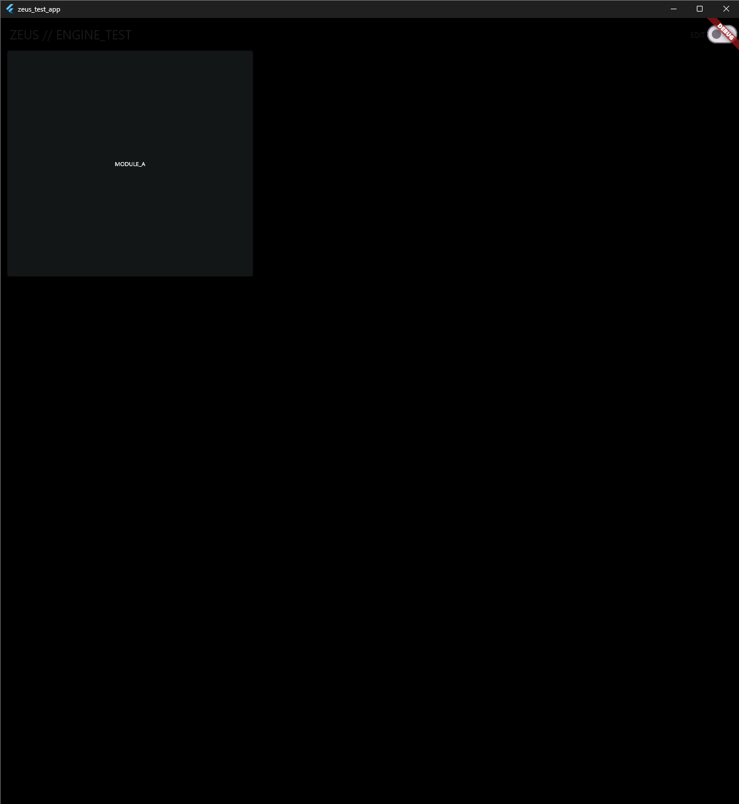
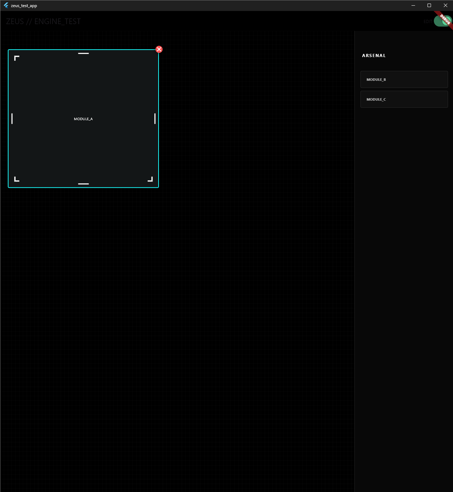
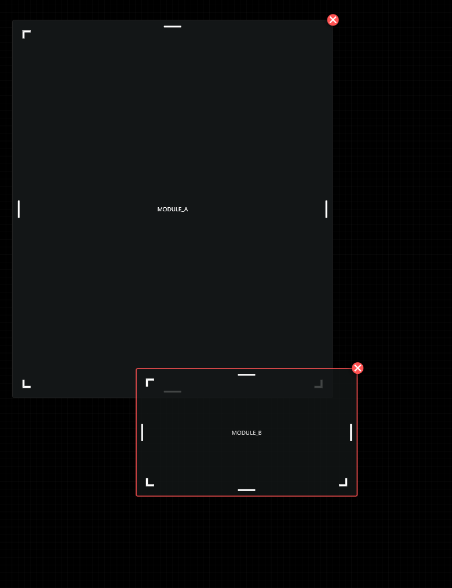

# ZeusGrid: Grid Based Container Engine

ZeusGrid is a Flutter package that provides a normalised coordinated canvas for building high-density, interactive dashboards. Unlike responsive layouts that "reflow" content, ZeusGrid treats the screen as a tactical map where every element has a fixed, logical position.

  

## Features

  

### 📐 Smart Proportional Scaling

The entire grid acts like a "living canvas." Instead of elements jumping around or stacking when you move from a desktop to a tablet, the grid perfectly shrinks or grows to fit the screen. Your layout remains consistent, meaning your most important data is always exactly where you expect it to be.

  



  

### Resize

Multi-Axis Resizing: Tactical "Grab Bars" on every side allow you to stretch or shrink modules to highlight the data that matters most right now.

Visual Feedback: The interface communicates with you—turning Cyan when a move is perfect and Red if you’re trying to overlap another module.


### Move

  

Simply press and hold any module to "un-dock" it from the grid. The interface provides instant feedback, allowing you to slide complex data monitors across the screen.

  

As you move a module, the system automatically aligns it to the underlying grid units. This eliminates "messy" layouts and ensures every pixel of your screen is utilized efficiently.


  

### Storage

  

The menu is a sleek, animated drawer that stays hidden during standard monitoring but slides into view instantly when you enter Edit Mode. This maximizes your screen real estate for high-density data.

  

The Arsenal is "Grid-Aware." If you remove a module from your dashboard, it instantly returns to the Arsenal. If you drag a module onto the grid, it disappears from the menu—ensuring you never have duplicate data monitors cluttering your workspace.

 
##  Getting started

  

###  Define  Your  Modules

  

```dart
final  List<ZeusModule> myModules = [

	ZeusModule(id: 'module_a', x: 0, y: 0, w: 40, h: 30),

	ZeusModule(id: 'module_b', x: 40, y: 0, w: 80, h: 30),

];
```
### Initialise the ZeusGrid

```dart
ZeusGrid(
	isEditing: _isEditMode,
	modules: myModules,
	onGenerateContent: (id) => MyModuleWidget(id),
	onModuleUpdate: (m) => setState(() => sync(m)),
	onModuleRemove: (id) => setState(() => remove(id)),
);
```

## Parameters

### Styling (Optional)

Styling has been made simple by defining gridStyle, moduleStyle, menuStyle in ZeusGrid().

```dart
ZeusGrid(
	gridStyle: GridStyle(lineColor: Colors.blueGrey.withOpacity(0.1)),
	moduleStyle: ModuleStyle(borderRadius: BorderRadius.circular(12), color: Colors.black),
	menuStyle: menuStyle: MenuStyle(width: 250, backgroundColor: Colors.black87),
)
```

### Handling State & Persistence

ZeusGrid follows a Unidirectional Data Flow pattern. The widget does not manage its own internal list of modules. Instead, it notifies the parent application when a user interacts with a module, allowing you to sync changes to a database, a state provider (Riverpod/Bloc), or local storage.


#### onModuleUpdate(ZeusModule module)

This callback fires whenever a module is moved or resized and the user releases their finger/mouse.

The Payload: Returns a new ZeusModule instance with updated x, y, w, h coordinates.

Usage: Use this to update your "Single Source of Truth."

Example:

```dart
 onModuleUpdate: (m) => setState(() {
	 final fromArsenalIndex = myArsenal.indexWhere(
	   (item) => item.id == m.id,
	 );

	if (fromArsenalIndex != -1) {
	  myArsenal.removeAt(fromArsenalIndex);
	  myModules.add(m);
	} else {
	   final i = myModules.indexWhere((item) => item.id == m.id);
	   if (i != -1) myModules[i] = m;
	}
}),
```

#### onModuleRemove(String id)

This callback fires when the user taps the Red Close Button on a module in Edit Mode.

The Payload: Returns the unique String id of the module to be removed.

Usage: Use this to move a module from your "Active" list back to your "Arsenal" (unplaced) list.

Example:

```dart
onModuleRemove: (id) => setState(() {
  // 🎯 MOVE: Grid -> Arsenal
  final removedIndex = myModules.indexWhere((m) => m.id == id);
  if (removedIndex != -1) {
    final removedModule = myModules.removeAt(removedIndex);
    myArsenal.add(removedModule);
  }
}),
```

## Why this Architecture?

By exposing these callbacks, the package remains highly portable.


Persistence: You can easily hook this up to Shared Preferences or Firebase so your layout persists across app restarts.

Validation: You can prevent certain modules from being moved or deleted based on user permissions (e.g., "Guest" users can't delete the Server Status card).

Global Sync: In a multi-user environment, you can broadcast the onModuleUpdate via WebSockets so the dashboard moves in real-time for everyone.


## Additional
This is intently built for a personal project and i saw the other dashboard packages didn't quite give me what i was looking for so i made my own, thought i would share that with everyone. Feel free to improve on it and let me know any improvements can be made :)
  

[](https://buymeacoffee.com/savisaar2d)
